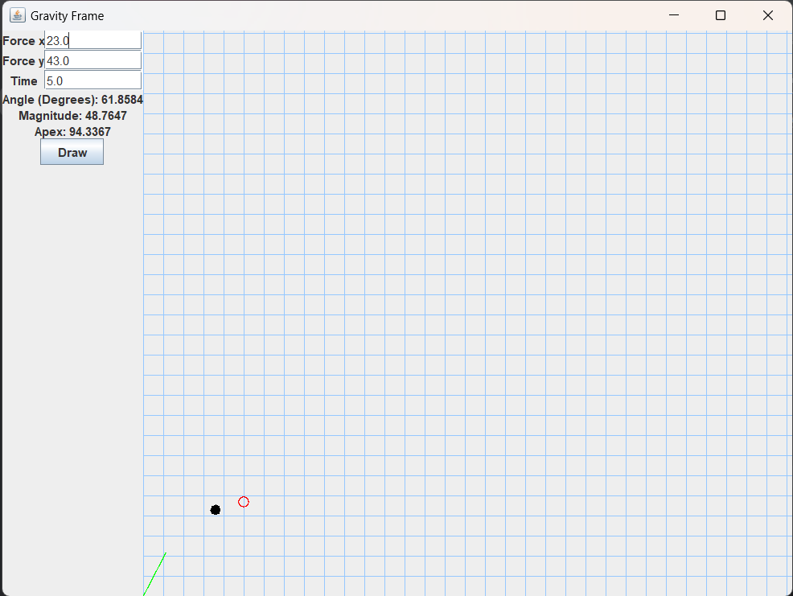

### Forces and Projectile Physics

Program to calculate and draw a projectile's path across the screen,
as well as the x value, y value, magnitude, and angle of the projectile's initial force
and the projectile's apex.
Projectile's force and path change in response to text entered on screen
or mouse being clicked or dragged.

### Screenshots

#### Links

- [JUnit](https://junit.org/)
- [Mockito](https://site.mockito.org/)
- [GridBagLayout](https://docs.oracle.com/javase/8/docs/api/java/awt/GridBagLayout.html)